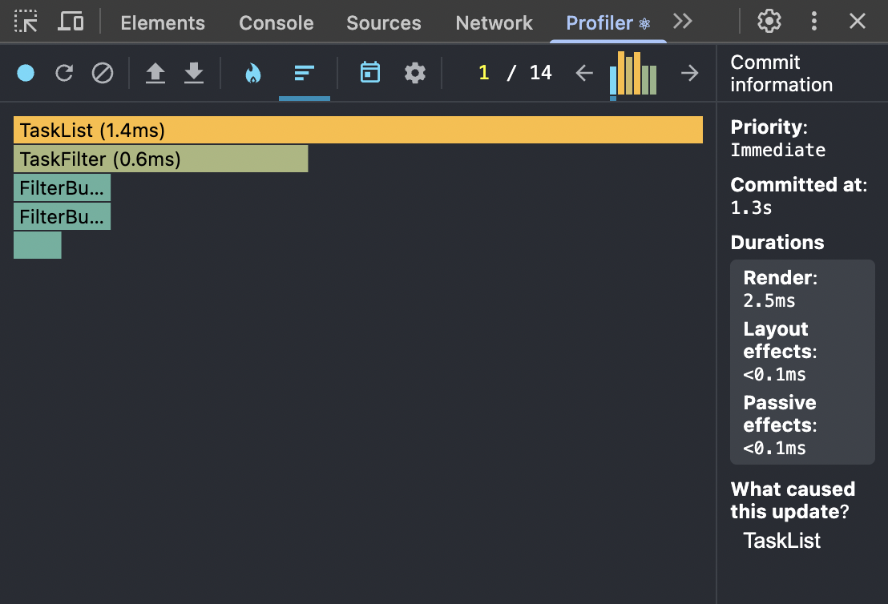

Profiler с memo TaskCard

Profiler БЕЗ TaskCard

Вывод:

1. Использование React.memo для TaskCard дало улучшение производительности
   До мемо: 6ms
   После мемо: 2.5ms
2. Компонент FilterButton - самый легкий, т.к. меняет только состояние active и быстро ререндерится 

